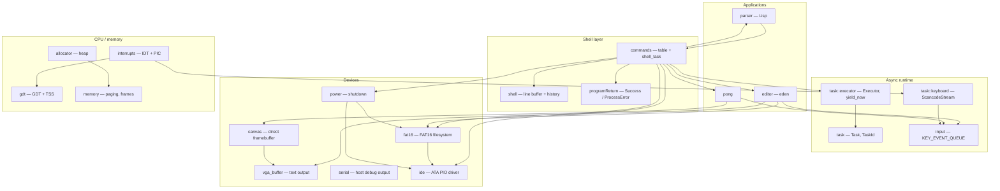

# SilOS Architecture

A map of how the kernel is put together, aimed at someone (human or agent) who needs to change it.

## 1. Crate layout

The package builds **two crates from the same source tree**, which is the first thing to
internalise:

- **`src/lib.rs`** — the `myOS` library crate. Every subsystem is a module here. It also owns the
  custom test harness (`test_runner`, `Testable`, `exit_qemu`, `test_panic_handler`).
- **`src/main.rs`** — the `myOS` binary crate. It is a *consumer* of the library and refers to it
  as `myOS::`, not `crate::`. Its only job is `kernel_main`: bring up subsystems in order, then
  hand control to the executor forever.

Anything in `src/` other than `main.rs` is reached as `crate::` from inside the library and as
`myOS::` from `main.rs` and from the integration tests in `tests/`.

Both crates are `#![no_std]`. `alloc` is available, but **only after `allocator::init_heap` has
run** — any allocation before that point faults.

## 2. Boot sequence

`bootloader` 0.9 handles real mode, long-mode setup and paging, then calls `kernel_main` through
the `entry_point!` macro with a `&'static BootInfo`.

```
entry_point!(kernel_main)
        │
        ├─ myOS::init()
        │     ├─ gdt::init()            load GDT + TSS, set CS, load TSS
        │     ├─ interrupts::init_idt() install exception + IRQ handlers
        │     ├─ PICS.initialize()      remap PIC to offsets 32/40
        │     └─ interrupts::enable()   sti — interrupts now live
        │
        ├─ memory::init(phys_mem_offset)          → OffsetPageTable
        ├─ BootInfoFrameAllocator::init(map)      → frame source
        ├─ allocator::init_heap(mapper, frames)   → 8 MiB heap at 0x4444_4444_0000
        │                                            ** alloc usable from here on **
        ├─ fat16::init()          read LBA 0, validate BPB, populate FS
        ├─ commands::init_cmds()  populate the COMMANDS table
        │
        └─ Executor::new()
              ├─ spawn(keyboard::print_keypresses())
              ├─ spawn(commands::shell_task())
              └─ run()   →  never returns
```

The ordering is load-bearing: the heap must exist before `fat16::init` (it allocates) and before
`init_cmds` (it builds a `BTreeMap` of boxed closures).

## 3. Layers



Note the deliberate cycle between `commands` and `parser`: the shell can run Lisp, and Lisp's
`sys` form runs shell commands. That mutual recursion is the whole point of the design, but it is
also why both sides traffic in `CommandFuture` rather than concrete types.

## 4. The async runtime

There are no threads, no preemption and no ring 3. Everything is one cooperative task set on a
single core.

- **`Task`** wraps a `Pin<Box<dyn Future<Output = ()>>>` with a monotonically-issued `TaskId`.
- **`Executor`** holds `tasks: BTreeMap<TaskId, Task>`, a lock-free `ArrayQueue<TaskId>` of
  ready tasks (capacity 100), and a `waker_cache`. `run()` loops: drain the ready queue polling
  each task, then `sleep_if_idle()`.
- **`sleep_if_idle`** disables interrupts, re-checks the queue, and issues `enable_and_hlt` — the
  disable/check/`sti;hlt` dance closes the race where an interrupt enqueues work between the check
  and the halt.
- **`TaskWaker`** implements `Wake` by pushing its `TaskId` back onto the ready queue. Wakers are
  cached per task so repeated polls do not reallocate.
- **`yield_now()`** is the cooperation primitive: it wakes itself and returns `Pending` once, which
  puts the task at the back of the queue. Long-running loops (`shell_task`, the editor, Pong) call
  it every iteration.

Because there is no preemption, **a task that never awaits hangs the machine.** Any loop added to
the kernel must contain a `yield_now().await`.

## 5. Keyboard input path

Input takes a deliberately long journey, and understanding it prevents a class of bugs:

```
IRQ1 ──► keyboard_interrupt_handler        (interrupts.rs)
             reads port 0x60 → raw scancode
             add_scancode()                 (task::keyboard)
                 push onto lock-free SCANCODE_QUEUE, WAKER.wake()
                                   │
                 ScancodeStream    ▼        a Stream<Item = u8>
             print_keypresses() task
                 pc_keyboard decodes scancode → KeyEvent
                 push_back onto KEY_EVENT_QUEUE   (input.rs)
                                   │
                                   ▼
             whichever foreground consumer is running calls input::pop_key()
                 shell_task / run_editor / PongGame::run
                 each owns its own Keyboard decoder to turn KeyEvent → DecodedKey
```

Two rules fall out of this:

1. **The interrupt handler must stay lock-free.** It only touches `ArrayQueue` and the PIC. Taking
   a spinlock there (for example to print) can deadlock against interrupted kernel code.
2. **`KEY_EVENT_QUEUE` has exactly one consumer at a time.** `shell_task`, the editor and Pong all
   drain the same queue. Whichever future is currently being awaited by `shell_task` is the de
   facto foreground application; the shell itself is blocked awaiting that future and so is not
   competing for keys.

Pong reads `KeyEvent` directly (it wants key-*down* and key-*up* for held paddles); the shell and
editor decode to `DecodedKey` (they want characters).

## 6. Display

Two independent views onto the same physical memory at `0xb8000`:

- **`vga_buffer::WRITER`** — the stateful, scrolling, line-oriented terminal behind `print!` and
  `println!`. It always writes to row 24 and scrolls the buffer up on newline. `_print` wraps every
  access in `without_interrupts` to avoid deadlocking against a handler that prints.
- **`canvas::TextCanvas`** — a stateless random-access grid used by Pong, which owns its own
  `&'static mut` to the same address.

`vga_buffer` also exposes `write_char_at`, `clear_screen` and `update_cursor` (which drives the
real hardware cursor over ports `0x3D4`/`0x3D5`) for the editor's use.

Aliasing `0xb8000` from two places is unsound by the letter of the rules but harmless in practice
here, because only one of them is ever active at a time.

## 7. Storage

```
commands / editor / parser
        │  8.3 names, byte slices
        ▼
fat16::Fat16FileSystem        holds only the parsed BPB; no cache
        │  512-byte sectors, LBA
        ▼
ide::AtaDrive                 PIO, ports 0x1F0–0x1F7, polls the status register
        ▼
QEMU IDE disk 1 → storage.bin
```

- **`ide`** is a synchronous, polling PIO driver — `read_sector` and `write_sector_bytes` busy-wait
  on BSY/DRQ. Writes are followed by a `0xE7` cache flush. There is no DMA and no interrupt-driven
  completion, despite an ATA IRQ handler being installed.
- **`fat16`** implements the on-disk structures directly: `cluster_to_lba`, FAT entry get/set,
  free-cluster scan, root-directory slot scan. It supports `find_file`, `read_file`,
  `write_new_file`, `overwrite_file` and `format_drive`.
- **Root directory only.** There are no subdirectories, no long filenames, and no delete command.
  `format_drive` lays down 1 reserved sector, 2 FATs of 64 sectors, 512 root entries and 4 sectors
  per cluster.
- `FS` is a `Mutex<Option<Fat16FileSystem>>` — `None` means the disk was not a valid FAT16 volume
  at boot. Every caller must handle that case.

**Lock ordering matters here.** `fat16` methods take `IDE.lock()` internally, so a caller holding
`FS.lock()` and then reaching for `IDE.lock()` is fine, but the reverse order is not. `power::teardown`
relies on this: it acquires and drops `FS.lock()` to prove no filesystem operation is in flight,
flushes the drive cache, and only then masks interrupts — spinlocks must never be left held once
interrupts are off.

## 8. Commands and the Lisp

`COMMANDS` is a `Mutex<BTreeMap<String, Arc<dyn Fn(Vec<String>) -> CommandFuture + Send + Sync>>>`,
where

```rust
type CommandFuture = Pin<Box<dyn Future<Output = Result<Success, ProcessError>> + Send>>;
```

Every command is a function from arguments to a boxed future. `run_cmd` clones the `Arc` out of
the map and *releases the lock before calling it* — necessary, because a command may itself call
`run_cmd` (that is exactly what Lisp's `sys` does).

`shell_task` is the shell's main loop:

1. Drain `KEY_EVENT_QUEUE`, decode, echo to screen, accumulate into `SHELL`.
2. On <kbd>Enter</kbd>, set the `COMMAND_PENDING` flag.
3. If pending, take the line, split on `?`, look up and `await` the command future.
4. Print `Success.success_code` only when `print_code` is set; print any `ProcessError`.
5. `yield_now().await`.

The interpreter in `parser.rs` is a tree-walking evaluator over `RispExp`
(`Bool | Symbol | Number | String | List | Map | Func | Lambda | Syscall`). `eval` is written as
`fn eval(...) -> Pin<Box<dyn Future<...>>>` rather than `async fn` so that it can recurse — a
plain `async fn` cannot name its own infinitely-sized future type.

`bind` closes over a Lisp source string and inserts a new closure into `COMMANDS`, so scripts
become first-class commands for the rest of the session.

## 9. Interrupts and faults

| Vector | Handler | Notes |
| --- | --- | --- |
| Breakpoint | `breakpoint_handler` | Prints the stack frame and returns |
| Double fault | `double_fault_handler` | Runs on IST stack 0 (5 × 4 KiB) so a stack overflow is recoverable enough to report |
| Page fault | `page_fault_handler` | Prints CR2 and the error code, then `hlt_loop()` |
| 32 — Timer | `timer_interrupt_handler` | EOI only; no scheduling is driven from it |
| 33 — Keyboard | `keyboard_interrupt_handler` | Reads `0x60`, enqueues the scancode |
| 46 — ATA primary | `ata_interrupt_handler` | EOI only; the driver polls instead |

The double-fault IST entry is the reason `gdt::init()` must run before `init_idt()`.

## 10. Testing

Because there is no `std`, `cargo test` uses `custom_test_frameworks` with `test_runner` from
`lib.rs`. Tests boot a real kernel in QEMU, write results to the serial port, and exit via the
`isa-debug-exit` device.

| Test binary | What it proves |
| --- | --- |
| `tests/basic_boot.rs` | The kernel boots and `println!` works before any subsystem init |
| `tests/heap_allocations.rs` | The heap allocates, reallocates and reuses freed memory |
| `tests/stack_overflow.rs` | The double-fault IST catches a guard-page hit instead of tripling |
| `tests/should_panic.rs` | A panic is detected as such (`harness = false`) |

`should_panic` and `stack_overflow` set `harness = false` in `Cargo.toml` because each can only
contain one test — the kernel does not survive them.

Unit `#[test_case]`s also live inline in `lib.rs` and `vga_buffer.rs`.

## 11. Invariants worth respecting

1. No allocation before `init_heap`.
2. Every loop awaits `yield_now()`.
3. Interrupt handlers stay lock-free.
4. Lock order is `FS` → `IDE`, never the reverse; never hold a spinlock across `interrupts::disable()`.
5. Anything touching `WRITER` from code that could be interrupted goes through `without_interrupts`.
6. `run_cmd` releases `COMMANDS.lock()` before invoking the command, so commands can recurse.
